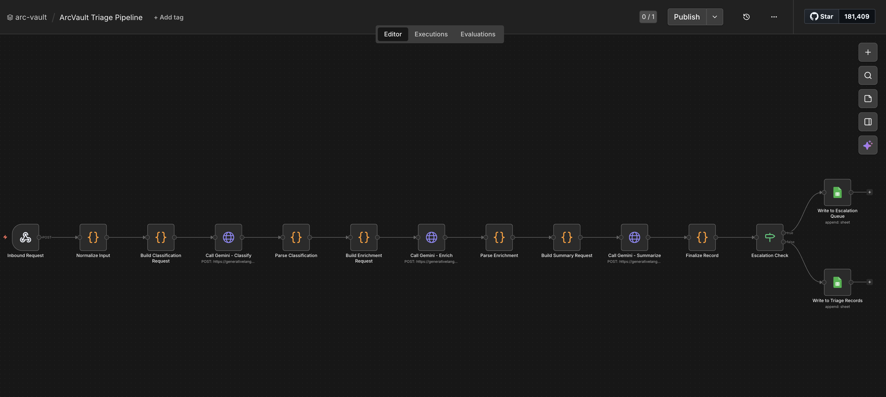

# AI Engineer Assessment Submission
**Valsoft Corporation | ArcVault Triage Pipeline**  
Candidate: Hussein Al Dawi | Email: hseneldowi@gmail.com | Submitted: March 2026

---

## Deliverables Index

| # | Deliverable | Format | Location |
|---|---|---|---|
| 4.1 | Working Workflow | n8n JSON export + Demo Video | `ArcVault Triage Pipeline.json` (attached) and [Screen Recording](https://drive.google.com/file/d/1EerkRn_MRPYoy4QYy98awNfM5Ho_ZnYz/view?usp=sharing) |
| 4.2 | Structured Output File | Google Sheet (live) | [arc-vault Google Sheet](https://docs.google.com/spreadsheets/d/1szbiE9jF_3neWyxr4xdFCgMsNtsKNzueEij4KxKk2Tk/edit?usp=sharing) |
| 4.3 | Prompt Documentation | This document, Section 3 | Below |
| 4.4 | Architecture Write-Up | This document, Section 2 | Below |

---

## Section 1 - System Overview

### What Was Built

An end-to-end AI-powered triage pipeline for ArcVault that automatically classifies, enriches, routes, and stores inbound customer support requests, with a human escalation path for high-risk or ambiguous cases.

### Tech Stack

| Tool | Role | Cost |
|---|---|---|
| n8n Cloud | Workflow orchestration, webhook trigger, routing logic | Free tier |
| Google Gemini 2.5 Flash | LLM classification, enrichment, summary generation | Free tier |
| Google Sheets | Structured output storage (2 tabs: triage + escalation) | Free |

### Workflow Screenshot



### Workflow Steps

```
Inbound Message (HTTP POST to Webhook)
        |
        v
[Step 1] INGESTION
   Extract: raw_message, source, timestamp
        |
        v
[Step 2] CLASSIFICATION  (Gemini 2.5 Flash, temp: 0)
   -> category     : Bug Report | Feature Request | Billing Issue |
                     Technical Question | Incident/Outage
   -> priority     : Low | Medium | High
   -> confidence   : 0-100
        |
        v
[Step 3] ENRICHMENT  (Gemini 2.5 Flash, temp: 0)
   -> core_issue              : one-sentence problem statement
   -> extracted_identifiers   : account ID, invoice #, error code
   -> urgency_signal          : Critical | Elevated | Normal
        |
        v
[Step 4] SUMMARY  (Gemini 2.5 Flash, temp: 0.2)
   -> 2-3 sentence summary written for the receiving team
        |
        v
[Step 5] ESCALATION CHECK  (Code node, rule-based)
   Escalate if ANY of:
   - confidence_score < 70
   - message contains "outage"
   - message contains "down for all"
   - billing discrepancy > $500
   - urgency_signal == Critical
        |
   -----+-----
   |         |
escalate   route
   |         |
   v         v
[Step 6a]  [Step 6b] ROUTING (deterministic map)
Escalation  -> Engineering  (Bug Report, Incident/Outage)
Queue tab   -> Product      (Feature Request)
            -> IT/Security  (Technical Question)
            -> Billing      (Billing Issue)
        |
        v
[Step 7] STRUCTURED OUTPUT to Google Sheets
   escalation_flag=true  -> tab: escalation_queue
   escalation_flag=false -> tab: triage_records
```

---

## Section 2 - Architecture Write-Up (Deliverable 4.4)

### System Design

The pipeline runs as a linear n8n workflow triggered by an HTTP webhook. Each message goes through six stages in order: ingestion, classification, enrichment, summary generation, escalation check, and output. There is no branching until the very end when the escalation check splits records into two paths, which keeps the whole thing easy to follow and debug.

All output is stored in Google Sheets. I went with Sheets because it is shareable, readable without any setup, and good enough for this scale. The two-tab structure keeps normal records and escalated ones visually separated so whoever is reviewing knows exactly where to look. n8n's execution log handles the per-run debugging side of things.

Gemini 2.5 Flash gets called three times per message: once for classification, once for enrichment, and once for the summary. I kept these as separate prompts rather than combining them into one because each prompt has a single job with its own output format. If the enrichment step breaks, classification still worked fine and I can debug just that one node. A single combined prompt would be one less API call but significantly harder to maintain and troubleshoot. I used Gemini's `responseMimeType: "application/json"` config on the classification and enrichment calls, which forces the model to return valid JSON at the API level rather than relying on prompt instructions alone. This prevented a whole category of parsing errors where the model would wrap output in markdown code blocks.

### Routing Logic

Routing is a simple hard-coded map from category to queue. The LLM produces a category string and the routing map converts that to a destination. I kept the LLM out of the routing decision itself because routing needs to be predictable. If a ticket ends up in the wrong queue, you need to be able to point at exactly why, and "the model decided" is not a good answer for that.

| Category | Queue | Reasoning |
|---|---|---|
| Bug Report | Engineering | Requires code-level investigation |
| Incident/Outage | Engineering | On-call team handles both bugs and outages |
| Feature Request | Product | PM triage and roadmap prioritization |
| Technical Question | IT/Security | Auth, SSO, and integration questions |
| Billing Issue | Billing | Finance team handles contractual disputes |
| Unknown / fallback | General | Human review for anything unrecognized |

Bug Reports and Incidents both go to Engineering because at this scale the same on-call engineer handles both. Splitting them would add routing complexity without any real operational benefit.

### Escalation Logic

A record gets escalated if any one of these conditions is true:

| Condition | Type | Why |
|---|---|---|
| `confidence_score < 70` | Model uncertainty | Do not auto-route when the model is not sure |
| Message contains "outage" | Keyword match | Service-level events need a human right away |
| Message contains "down for all" | Keyword match | Signals widespread multi-user impact |
| Billing discrepancy over $500 | Numeric check | Financial risk that needs human sign-off |
| `urgency_signal == "Critical"` | Model signal | Model flagged multi-user or data-loss impact |

All five conditions get evaluated together in a single Code node using OR logic, so any one of them is enough to trigger escalation. The keyword and numeric rules are what actually fire most of the time. Modern models like Gemini 2.5 Flash rarely score below 70% confidence when the message has any recognizable structure, so the confidence threshold mainly catches genuinely malformed or ambiguous inputs.

One honest limitation worth noting: the current escalation logic only catches what I wrote rules for. A message like "all 500 of our enterprise users have been locked out since this morning" would slip through because it does not contain any of the trigger keywords. In production, I would layer a focused LLM call on top of the rule-based check to catch the semantic cases that rules miss, while keeping the rules as the fast first pass for the obvious ones.

### Production Scale Considerations

- **Reliability:** Add retry logic on all Gemini API nodes (n8n supports this natively with exponential backoff). Add a third sheet tab as a dead-letter queue for records that errored mid-execution.
- **Cost and throughput:** Replace Google Sheets with a proper database (Supabase or Postgres) at production volume. Use Gemini's Batch API for queued messages processed during off-peak hours to keep costs down.
- **Latency:** Three sequential LLM calls currently take around 3-6 seconds per message. Classification and enrichment could run in parallel using n8n's parallel branch feature to cut that roughly in half. Summary generation has to stay sequential since it depends on enrichment output.
- **Observability:** Structured execution logs in a database with fields like `execution_id`, `step_name`, `duration_ms`, and `error` would make it possible to build latency dashboards and catch failure patterns that n8n's built-in log cannot surface at scale.
- **Escalation logic:** As mentioned above, adding a lightweight LLM escalation check on top of the existing rules would close the gaps that keyword matching misses, without adding latency to every single message.

### Phase 2 - If Given Another Week

1. **Gmail trigger:** Swap the webhook for an n8n Gmail watcher node so real inbound emails kick off the workflow automatically.
2. **Correction feedback loop:** Add a correction column to the sheet. When a reviewer manually fixes a wrong category, capture it and feed it back as a few-shot example in the next prompt iteration to improve accuracy over time.
3. **Duplicate detection:** Before routing, check whether the same account already has an open ticket in the same category. Link them instead of creating a duplicate.
4. **SLA timer:** For High-priority tickets, kick off a 30-minute Wait node after writing the record. If no acknowledgment is logged in the sheet by then, auto-escalate it.

---

## Section 3 - Prompt Documentation (Deliverable 4.3)

### Prompt 1 - Classification

```
SYSTEM:
You are a B2B SaaS support triage classifier. Your job is to analyze inbound
customer messages and return a structured JSON classification.
Be consistent and precise.

USER:
Classify the following customer message.

Message: {raw_message}
Source: {source}

Return a JSON object with this exact structure:
{
  "category": "<one of: Bug Report, Feature Request, Billing Issue, Technical Question, Incident/Outage>",
  "priority": "<one of: Low, Medium, High>",
  "confidence_score": <integer 0-100>
}

Priority rules:
- High: service down, data loss, security issue, billing discrepancy > $200
- Medium: functionality broken for the user, billing questions, auth issues
- Low: feature requests, general inquiries, how-to questions

Confidence score: how certain you are about the category (0=uncertain, 100=certain).
```

**API config:** `temperature: 0`, `responseMimeType: "application/json"`

**Design rationale:** I set temperature to 0 so the same message always produces the same output, which makes the routing behavior predictable. I used `responseMimeType: "application/json"` rather than adding "output only valid JSON" to the prompt text because the API-level enforcement is more reliable. Models sometimes ignore natural language formatting instructions and wrap output in code blocks, which breaks the downstream JSON parser. The category labels match the spec exactly so the routing switch node can do exact string matching without any normalization. The priority rules are written out explicitly as heuristics rather than leaving it to model judgment because it makes the behavior auditable. The main tradeoff is that these rules are hardcoded in the prompt, which is brittle. A production system would store them as config in a database. Given more time, I would add a couple of few-shot examples for the edge cases where categories overlap, like Technical Question vs. Bug Report, to help the model calibrate confidence scores better.

---

### Prompt 2 - Enrichment

```
SYSTEM:
You are a support ticket enrichment agent. Extract structured information
from customer messages.

USER:
Extract structured information from this customer message.

Message: {raw_message}
Category: {category}

Return a JSON object with this exact structure:
{
  "core_issue": "<one sentence describing the core problem or request>",
  "extracted_identifiers": {
    "account_id": "<account ID or username if mentioned, else null>",
    "invoice_number": "<invoice number if mentioned, else null>",
    "error_code": "<error code if mentioned, else null>",
    "other": "<any other relevant ID or reference, else null>"
  },
  "urgency_signal": "<one of: Critical, Elevated, Normal>"
}

Urgency signal:
- Critical: multiple users affected, full service outage, data loss, security breach
- Elevated: single user blocked, billing discrepancy, auth failure, time-sensitive
- Normal: general inquiry, feature request, non-blocking question
```

**API config:** `temperature: 0`, `responseMimeType: "application/json"`

**Design rationale:** The enrichment step pulls out only what is actually useful for the receiving team: a one-sentence summary of the problem so they do not have to read the raw message, specific identifiers so they can look things up in their own systems, and an urgency signal. I kept urgency separate from priority on purpose. Priority is a routing signal that determines which queue a ticket lands in. Urgency is a human signal that describes the real-world impact in the message. A Low priority Feature Request might be Normal urgency, but a billing discrepancy could be Elevated even if it ends up in the Billing queue. All identifier fields have a null fallback in the schema so the JSON structure stays consistent regardless of what the message contains. Inconsistent structure would cause parsing errors downstream. With more time I would split `account_id` into subtypes like username, email, and org ID since those map to different lookup systems.

---

### Prompt 3 - Summary Generation

```
SYSTEM:
You are a support ticket summarizer. Write a clear, professional 2-3 sentence
summary suitable for the internal team receiving this ticket. Be factual,
include key identifiers, and state the required action. Return only the summary
text, no JSON, no bullet points, no headings.

USER:
Write a 2-3 sentence human-readable summary of this support ticket for the
receiving team.

Original message: {raw_message}
Category: {category}
Priority: {priority}
Core issue: {core_issue}
Identifiers: {extracted_identifiers}

Return only the summary text, no JSON.
```

**API config:** `temperature: 0.2`, no `responseMimeType`

**Design rationale:** I bumped temperature to 0.2 here because the output is prose and a little variation makes summaries read more naturally. I left out `responseMimeType` on this call intentionally. When I had it set to `application/json` during testing, Gemini returned the summary wrapped in a JSON object instead of plain text, which meant I had to add extra parsing just to get the string out. Removing it from this node fixed that cleanly. The system instruction tells the model to write for the receiving team, not the customer, so the tone stays internal and action-focused. All enriched fields get passed in as context so the summary can reference specific identifiers like invoice numbers and account IDs. The tradeoff is that summaries are slightly non-deterministic, two runs on the same input might word things a bit differently. That is fine for a human-readable field, but in production I would add a word count cap to keep summary length consistent.

---

## Section 4 - Output Records (Deliverable 4.2)

All five sample inputs were processed through the live workflow. The full output for each record, including category, priority, confidence score, extracted identifiers, routing destination, escalation flag, and summary, is in the shared Google Sheet:

**[arc-vault Google Sheet](https://docs.google.com/spreadsheets/d/1szbiE9jF_3neWyxr4xdFCgMsNtsKNzueEij4KxKk2Tk/edit?usp=sharing)**

- Tab `triage_records` contains the auto-routed records (Messages 1, 2, 4)
- Tab `escalation_queue` contains the flagged records that need human review (Messages 3, 5)

---

## Section 5 - Workflow File (Deliverable 4.1)

The complete n8n workflow is included as `ArcVault Triage Pipeline.json`.

**To run it:**
1. Import into n8n Cloud: New Workflow, then menu, then Import from file
2. Connect credentials: Settings, Credentials, New, HTTP Header Auth (`x-goog-api-key: AIza...`)
3. Connect Google Sheets OAuth2 credential and set your Sheet ID in both Sheets nodes
4. Click **Listen for Test Event** on the Webhook node
5. Run any of the 5 curl commands below

**Test commands:**

```bash
# Message 1 - Bug Report
curl -X POST https://hdev.app.n8n.cloud/webhook-test/arcvault-intake \
  -H "Content-Type: application/json" \
  -d '{"source": "Email", "message": "Hi, I tried logging in this morning and keep getting a 403 error. My account is arcvault.io/user/jsmith. This started after your update last Tuesday."}'

# Message 2 - Feature Request
curl -X POST https://hdev.app.n8n.cloud/webhook-test/arcvault-intake \
  -H "Content-Type: application/json" \
  -d '{"source": "Web Form", "message": "We'\''d love to see a bulk export feature for our audit logs. We'\''re a compliance-heavy org and this would save us hours every month."}'

# Message 3 - Billing Issue (escalates: $1,240 is over the $500 threshold)
curl -X POST https://hdev.app.n8n.cloud/webhook-test/arcvault-intake \
  -H "Content-Type: application/json" \
  -d '{"source": "Support Portal", "message": "Invoice #8821 shows a charge of $1,240 but our contract rate is $980/month. Can someone look into this?"}'

# Message 4 - Technical Question
curl -X POST https://hdev.app.n8n.cloud/webhook-test/arcvault-intake \
  -H "Content-Type: application/json" \
  -d '{"source": "Email", "message": "I'\''m not sure if this is the right place to ask, but is there a way to set up SSO with Okta? We'\''re evaluating switching our auth provider."}'

# Message 5 - Incident/Outage (escalates: "outage" keyword and Critical urgency)
curl -X POST https://hdev.app.n8n.cloud/webhook-test/arcvault-intake \
  -H "Content-Type: application/json" \
  -d '{"source": "Web Form", "message": "Your dashboard stopped loading for us around 2pm EST. Checked our end, it'\''s definitely on yours. Multiple users affected."}'
```

---

*Submitted for Valsoft Corporation AI Engineer Technical Assessment - March 2026*
